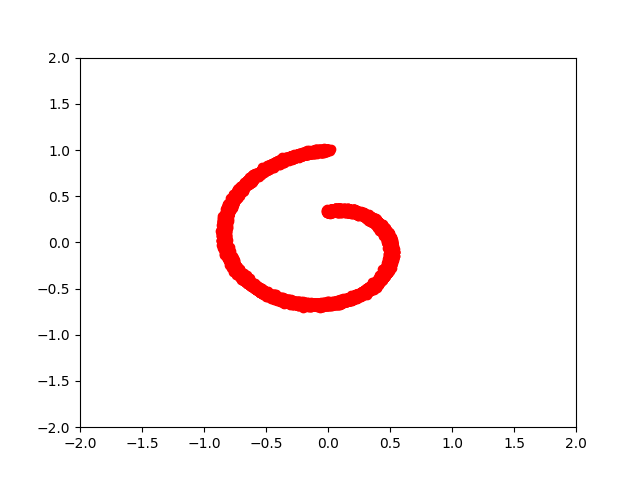
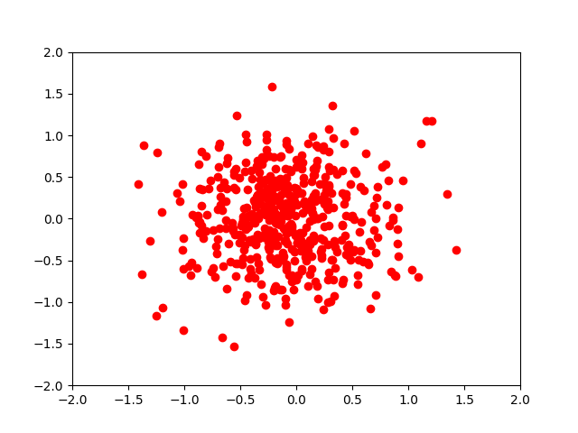

# Variational Walkback

Tensorflow Reimplementation of 
["Variational Walkback: Learning a Transition Operator as a Stochastic Recurrent Net"](https://arxiv.org/abs/1711.02282)

Author's original theano impelementation is [here](https://github.com/anirudh9119/walkback_nips17)

# Result

Spiral data distribution.

Generation result during 40 steps.

I'm also trying MNIST dataset, but haven't succeeded to reproduce the same result like the paper yet.
